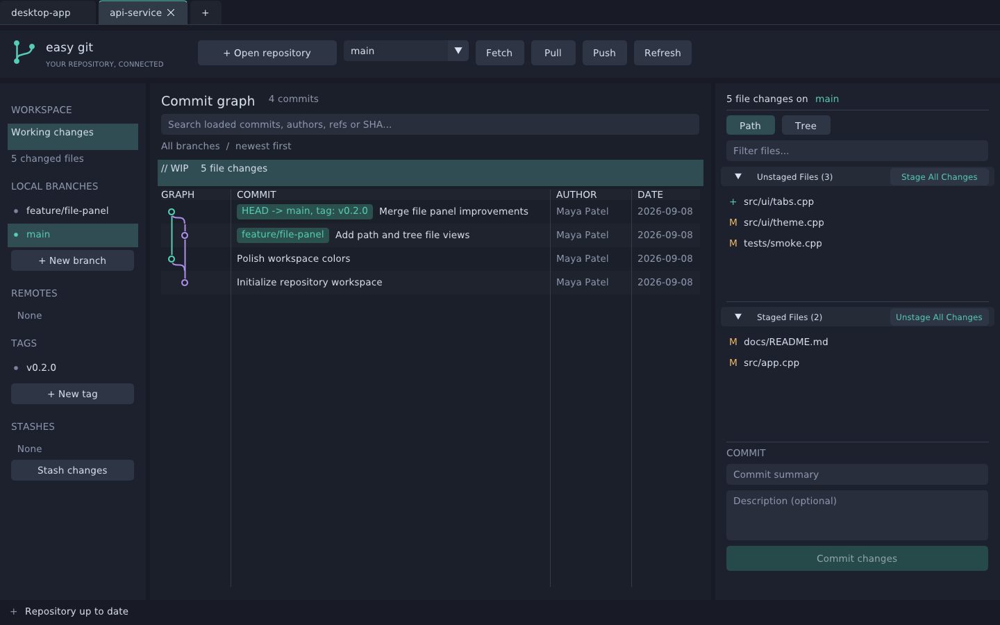
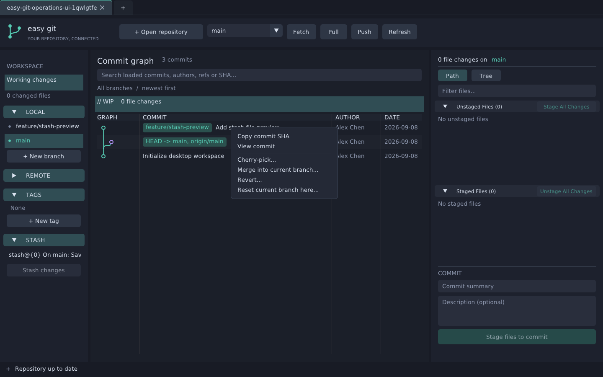
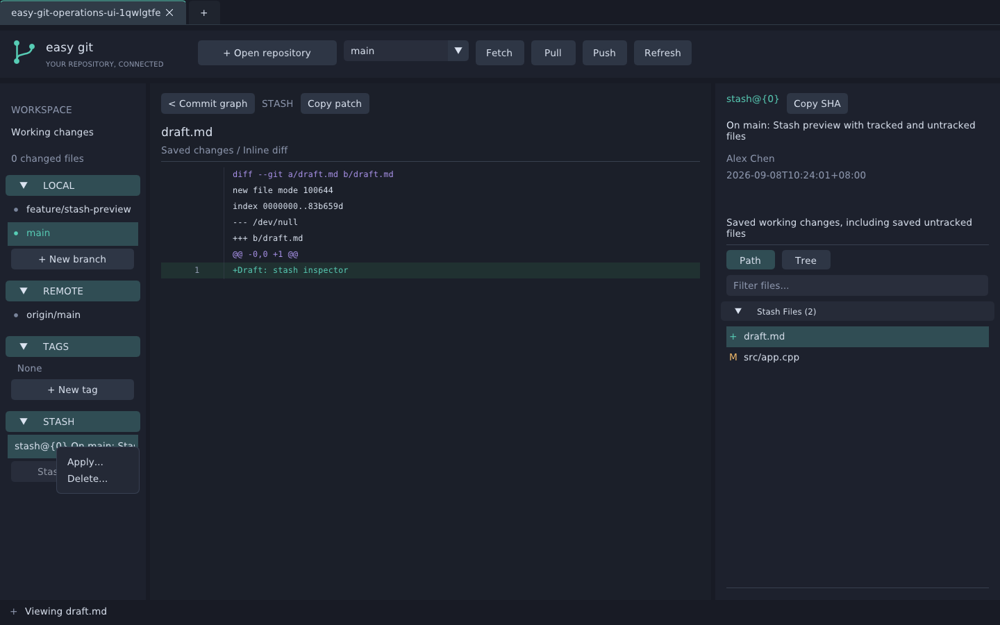
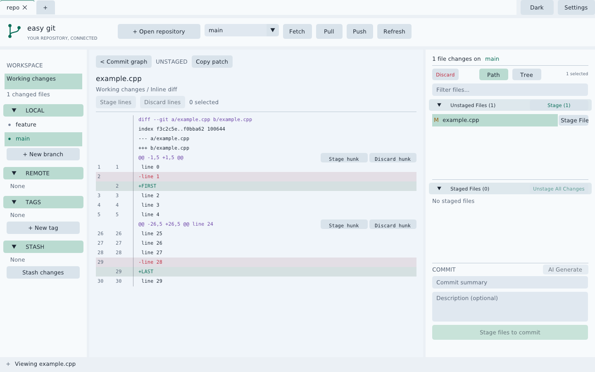
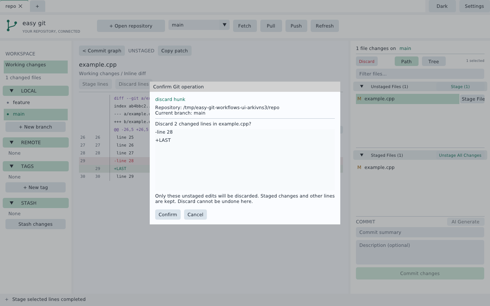
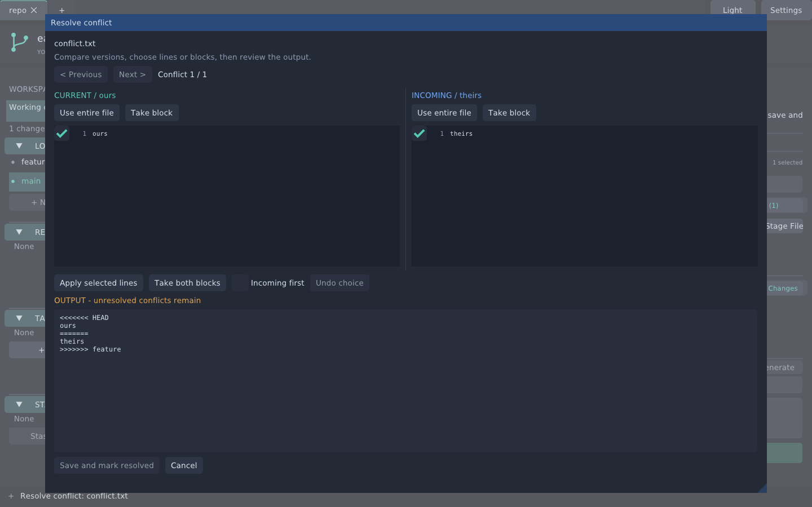
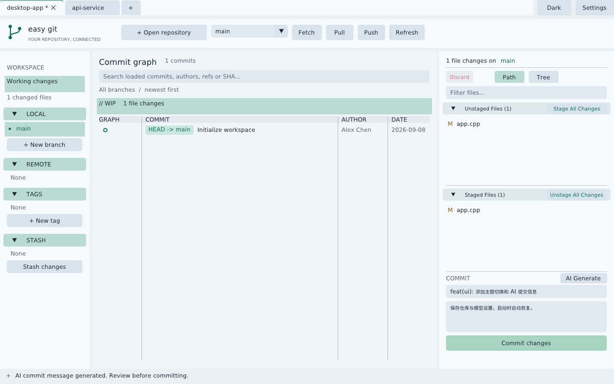

# Easy Git

**English** | [简体中文](README.zh-CN.md)

A Linux desktop Git client built with **C++17 and Dear ImGui**, featuring commit graphs, multi-repository tabs, and optional AI commit messages.

Easy Git takes inspiration from GitKraken's three-panel interface. It is an independent project and is not affiliated with or endorsed by GitKraken. The project is in early development and is available under the [MIT license](LICENSE).



## Features

- **Multiple repositories:** browse folders, open and reorder repository tabs, and restore open repositories on startup. Each tab keeps its own draft, selection, and view state during the session.
- **Commit graph:** inspect branches, merges, commit details, and changed files. Commit and stash times use the computer’s local timezone (including daylight saving); graph rows show date and time, with seconds and timezone in details/tooltips. Clicking a local or remote branch scrolls to its tip, loading additional history when necessary.
- **File workflow:** separate Unstaged and Staged panels, Path and Tree views, filtering, inline diffs with line numbers, Ctrl/Shift selection, file/line/hunk staging, unstaging, and confirmed discard.
- **Git operations:** commit, create and switch branches, create tags, fetch, fast-forward-only pull, push, cherry-pick, merge, revert, soft/mixed/hard reset, clone, initialization, branch deletion, and force push with an explicit lease.
- **Stash:** save tracked and untracked changes; click to preview, then use the context menu to apply or delete. Conflict operations expose Continue, Abort, and Skip where supported.
- **Appearance:** light and dark themes, automatic window-size restoration, and resizable panels. Local, Remote, Tags, and Stash keep their collapse headers visible while their lists scroll independently. Drag the horizontal separators to resize expanded sections; collapsed sections release their space. Heights and collapse states are independent per repository for the current session.
- **Optional AI:** generate an editable commit draft from staged changes using OpenAI or Anthropic compatible APIs, with 36 searchable provider/platform presets and independent, named model configurations.

## Debian package

Download the [v0.1.2 amd64 `.deb`](https://github.com/NickCyrusss/easy_git/releases/download/v0.1.2/easy-git_0.1.2_amd64.deb) and [SHA256SUMS](https://github.com/NickCyrusss/easy_git/releases/download/v0.1.2/SHA256SUMS) from [GitHub Releases](https://github.com/NickCyrusss/easy_git/releases/tag/v0.1.2). Packages are built and tested on Ubuntu 22.04 (x86-64).

```sh
sha256sum -c SHA256SUMS
sudo apt install ./easy-git_0.1.2_amd64.deb
```

The package includes the application-menu launcher and icon. Launch **Easy Git** or run `easy_git`; remove with `sudo apt remove easy-git`. User configuration in `~/.easy_git` is retained.

To build a package locally (requires `dpkg-dev` plus the build dependencies below):

```sh
cmake -S . -B build-deb -G Ninja -DCMAKE_BUILD_TYPE=Release -DCMAKE_INSTALL_PREFIX=/usr
cmake --build build-deb -j 4
ctest --test-dir build-deb --output-on-failure
(cd build-deb && cpack -G DEB)
```

The `.deb` is written to `build-deb/`. Pushing a version tag matching the CMake version (for example `v0.1.2`) runs the Debian release workflow: build, test, install-check, and upload the package and checksum to GitHub Releases.

## Build and run

Requires Linux, Git, CMake 3.22+, a C++17 compiler, OpenGL, X11, libcurl, and json-c. On Ubuntu/Debian:

```sh
sudo apt install build-essential cmake ninja-build git libgl1-mesa-dev \
  libx11-dev libxrandr-dev libxinerama-dev libxcursor-dev libxi-dev \
  fonts-dejavu-core fonts-noto-cjk zenity pkg-config libcurl4-openssl-dev libjson-c-dev

git clone https://github.com/NickCyrusss/easy_git.git
cd easy_git
cmake -S . -B build -G Ninja -DCMAKE_BUILD_TYPE=Release
cmake --build build -j 4
./build/easy_git
```

The executable embeds its window/taskbar icon. To add Easy Git to your Linux application menu with an icon, install it for the current user:

```sh
cmake -S . -B build -DCMAKE_INSTALL_PREFIX="$HOME/.local"
cmake --build build -j 4
cmake --install build
```

This installs the executable, desktop launcher, and icon. Launch **Easy Git** from the application menu; file managers may still show a generic icon for the ELF executable itself.

Use **Browse...** to choose a repository, or pass one or more paths:

```sh
./build/easy_git /path/to/repository
./build/easy_git /path/to/repository-a /path/to/repository-b
```

The folder picker uses Zenity. Manual path entry remains available when it is not installed. Paths inside a repository resolve to its root, and reopening the same root selects its existing tab.

CMake downloads Dear ImGui **v1.92.5** and GLFW **3.4** with SHA-256 verification. For offline builds, set `FETCHCONTENT_SOURCE_DIR_IMGUI` and `FETCHCONTENT_SOURCE_DIR_GLFW` to local source directories, or place those versions in `.deps/imgui-1.92.5` and `.deps/glfw-3.4`.

No proxy is required by default. If your network needs one for dependency downloads, set `https_proxy` and `http_proxy` before running CMake, for example to `http://127.0.0.1:32766`. The application's AI proxy is configured separately and defaults to an empty value (direct connection).

## Everyday workflow

1. Select **Working changes** or **// WIP** to inspect unstaged and staged files. Click a file to display its diff; use **< Commit graph** to return to history and clear file/line selections.
2. Stage individual files or a selection. **Ctrl+click** toggles a file, **Shift+click** selects a range, and **Ctrl+Shift+click** adds a range. Tree selection follows visible directory order and skips collapsed entries.
3. Enter a summary and optional description, then click **Commit changes**. Commits require staged changes and no unresolved conflicts. Configure your Git author identity before your first commit.
4. Select a commit to browse **Changed Files**, or right-click a commit/branch for Git operations. Clicking a sidebar branch navigates to its tip; checkout is a separate action in the branch selector or context menu.
5. Press **F5** to refresh after external changes. Git work runs asynchronously, and failures display the command error.

Hover a file row and click **Stage File** or **Unstage** directly; selecting the file first is optional. The button stays available while you hold the mouse button and executes on release. Row buttons affect only that file. With no files selected, the group’s **Stage All Changes** / **Unstage All Changes** button applies to the entire group; with a selection, it applies to the selected files.

With no file selected, **Discard** targets all unstaged files in the repository, including files hidden by filtering or collapsed folders. Selecting unstaged files limits Discard to that selection; selecting only staged files disables it. The confirmation lists the exact scope, and Cancel keeps the changes. **Discard** removes unstaged changes while preserving staged content; discarding untracked files deletes them. Conflicts, directories, and submodules require handling in an editor or their own repository.

**Hard reset** requires an extra confirmation because it overwrites the index and working tree and can remove untracked paths that obstruct checkout. Soft reset keeps staged and working changes; mixed reset resets the index but keeps working files.

The toolbar **Stash** button after **Pull / Push** immediately saves all staged, unstaged, and untracked changes in the active repository (excluding ignored files). It uses **Commit summary** as the stash message, or `Saved from easy git` when empty, and clears **Commit summary** after success while keeping the description. A failed stash keeps the summary; a new summary typed while the operation runs is also preserved. The button is disabled when there are no changes, before the first commit, or while an operation is running.

Stashes appear immediately before their own base commit in **Commit graph**, displaying a purple **STASH** badge beside their names without the `stash@{n}` prefix and connected to that commit, with author/date and search support. Multiple stashes on the same base appear newest first. If the base is outside the loaded history, its stashes remain available in the sidebar and appear in the graph when the base is loaded. Clicking a stash in the graph or sidebar only previews its files and diffs; both offer **Apply / Delete** in the context menu. **Apply** retains the stash and can restore the index; **Delete** asks for confirmation and rejects stale list positions. Click a conflicted file to open the built-in editor, save its resolution, and use **Continue** when an operation is in progress. Stash-apply conflicts follow the normal stage-and-commit workflow.





## Partial staging, discard, and conflict resolution

In a working-tree diff, click changed lines to select them, use Ctrl/Shift to adjust the selection, then click **Stage lines** or right-click **Stage selected lines**. Each `@@` header has a **Stage hunk** button. Open a file from **Staged Files** to use **Unstage lines** or **Unstage hunk**. Stage/Unstage changes only the index and rejects stale previews. Binary files, symlinks, submodules, and renames use whole-file operations.

For replacements, selecting either the old or new line selects both for Stage, Unstage, and Discard. Consecutive replacements with equal old/new line counts pair by position; unequal counts select the whole continuous replacement block. Pure additions/deletions remain individually selectable. Highlighting and Discard confirmation show the full selection.

Open a file from **Unstaged Files** to select changed lines and click **Discard lines** (also available in the right-click menu), or use **Discard hunk** beside a `@@` header. Confirmation lists the selected lines. Discard reverses only those working-tree edits, preserves staged content and other changes, and rejects a changed preview. Partial discard supports regular text files up to 1 MiB; discarding all lines of an untracked file removes it. Discarded edits cannot be undone in the app.

Click a conflicted file to open **Resolve conflict**. **Current / ours** and **Incoming / theirs** appear side by side above an editable **Output**. Navigate unresolved blocks with Previous/Next or arrow keys outside text input. Check individual lines on either side and **Apply selected lines**, **Take block**, or **Take both blocks**; **Incoming first** controls the order when combining both sides. **Undo choice** restores up to 16 selection operations; manual output edits retain the text editor's own undo behavior. You can also **Use entire file** or **Accept deletion**; binary conflicts support entire-version selection only. Saving is disabled while conflict markers remain. **Save and mark resolved** writes and stages the result without committing, and rejects externally changed files or index entries. The editor supports regular files up to 1 MiB. During rebase, Current is the rebased base and Incoming is the replayed commit.

Use the **Open / Clone / Initialize** choices in the repository dialog to open, clone into a new or empty folder, or initialize a folder with an initial branch name. Clone and initialization open the resulting repository automatically; initialization leaves existing files uncommitted.

Right-click a local or remote branch and choose **Delete branch...**. Local deletion checks whether the branch is merged; an explicit checkbox permits unmerged deletion, while checked-out branches remain protected by Git. Remote deletion checks the remote tip before deleting it. Right-click **Push** or the current local branch for **Force push with lease...**; review the source/target and confirm. An upstream and fetched tracking reference are required. The recorded lease refuses to overwrite a remote tip that changed after it was observed.

Interaction references: [GitKraken partial staging](https://support.gitkraken.com/working-with-commits/staging/) and [merge conflict workflow](https://help.gitkraken.com/gitkraken-desktop/branching-and-merging/).







## Themes, AI, and saved settings

The top-right **Light / Dark** button switches themes. **Settings** controls AI generation, which is disabled by default.

1. Enable AI commit messages and search **AI Provider / Model** to choose a preset. The 36 presets cover Chinese and international providers, inference platforms, and local servers; see the [provider catalog and official references](docs/ai-providers.md). Use **Add model** to create additional named configurations, including multiple models from the same provider. **Delete model** removes custom configurations after confirmation; built-in presets cannot be deleted.
2. Choose **Request format**: **OpenAI** (Chat Completions) or **Anthropic** (Messages). Set your API base URL, model/endpoint ID, and API key. You can also configure the proxy, output language, timeout, output token limit, diff size limit, and style instructions. Preset model IDs and URLs are editable for your account and region.
3. Switch providers to restore their individual settings, including request format, keys and customized model names. A provider's first selection uses its defaults. **Save settings** saves all profiles edited in the dialog; **Cancel** discards the dialog's edits, including added or deleted models.
4. Stage your changes and click **AI Generate**, to the right of **COMMIT**. Review the returned summary and description before committing. Generation never commits automatically.

Only the staged diff and its statistics are sent to the selected provider. Unstaged changes are excluded. The default diff limit is **65,536 bytes**; larger requests are rejected instead of silently truncated. **Cancel AI** cancels a request; failures preserve the draft, and results are rejected if the index changed during generation. Requests may incur charges from your provider.

OpenAI format sends Bearer authentication and reads `choices[].message.content`; its **Token limit field** selects `max_tokens` or `max_completion_tokens` (the OpenAI preset uses the latter). Anthropic format sends `x-api-key` and `anthropic-version`, a top-level system prompt, and reads text blocks from `content[]`, excluding thinking blocks. Truncated or incomplete responses are rejected. Remote endpoints must use HTTPS; localhost endpoints may use HTTP and bypass the proxy. Base URLs and full `/chat/completions` or `/messages` endpoints are accepted. Changing format may require changing the URL to the provider’s corresponding compatible API; it does not make an unsupported API compatible. The proxy defaults to blank (direct).

Window width and height are saved automatically after resizing and restored on startup (minimum 1080 × 720). Window position, maximized state and panel layouts are not saved.

Window dimensions, open repositories, the active repository, theme, and all AI profiles are saved to **`~/.easy_git`** as JSON and restored on startup. Saves replace the file atomically with **0600** permissions. API keys are stored as plaintext in this owner-only file. Existing single-provider configurations remain supported. The old fixed **Custom** entry migrates to a deletable **Imported model** profile without losing its settings; legacy files retain their original OpenAI request format. A malformed file is preserved and reported until you explicitly save replacement settings.

Use a separate configuration file for testing:

```sh
./build/easy_git --config /tmp/easy-git-test.json /path/to/repository
```

Git authentication uses your existing SSH configuration or credential helper. The application does not store Git credentials or prompt for terminal passwords. Git HTTP(S) operations inherit the process's proxy environment; SSH uses your SSH configuration.



## Tests

```sh
ctest --test-dir build --output-on-failure
```

Tests create disposable repositories under `/tmp`:

| Test | Coverage |
| --- | --- |
| `git_workflow` | Status, unusual paths, staging, commits, commit graphs, pagination, file diffs, stash, and local remote operations |
| `git_operations` | Cherry-pick, merge, revert, reset modes, stash handling, conflict continuation/abort/skip, and discard protections |
| `git_workflows` | Partial staging/unstaging/discard, linked replacement lines and preserved line order, selection isolation and stale-preview rejection, conflict resolution and leftover diff3 marker rejection, clone/init, local/remote branch deletion, and force-push lease rejection |
| `settings_and_ai` | Configuration replacement and permissions, window-size round trips and validation, per-model settings and migration, custom model add/delete protection, OpenAI/Anthropic HTTP requests and responses, cancellation, and stale-index protection |
| `repository_tabs` | Headless ImGui interactions, fixed sidebar headers with independent scrolling and draggable section separators, independent tabs and drafts, branch navigation, file selections, unselected row actions with mouse press/hold/release, Stage All/Unstage All without selection, toolbar Stash naming and saved content at 1080×720, summary clearing on success and retention on failure, stash grouping by base commit, paginated base loading, graph stash search and preview, batch operations, settings Save/Cancel including model add/delete, partial unstage, linked line selection with Ctrl/Shift and complete discard confirmation/cancellation, external diff refresh after edits/atomic saves/deletion/restoration, staged-preview isolation, local timestamps across timezones and daylight saving, conflict line selection/order/undo and output-size protection, and restart recovery |

AI tests use a local loopback HTTP server and require permission to listen on a local port. They do not call paid providers. Actual provider calls require your own API key and have not been validated by these tests.

Build and test the backend without GUI dependencies:

```sh
cmake -S . -B build-core -DEASY_GIT_BUILD_GUI=OFF
cmake --build build-core -j 4
ctest --test-dir build-core --output-on-failure
```

Optional GUI smoke check, with `xvfb` and `xauth` installed:

```sh
xvfb-run -a -s '-screen 0 1440x900x24' \
  ./build/easy_git /path/to/repository --config /tmp/easy-git-smoke.json \
  --frames 30 --screenshot /tmp/easy-git.ppm
```

Screenshots in `docs/` come from the running application with temporary demonstration repositories. Mouse-driven checks cover staging one hunk, confirming discard of another while preserving staged content, and unstaging the first hunk while retaining its working-tree edits. Native window resizing and restart restoration were also checked under Xvfb: resizing to 1220 × 780 automatically saved only width/height, and the next launch restored that size.

Check the embedded icon and desktop window identity (requires Python 3, `xvfb`, `xauth`, and `xprop` from `x11-utils`). The test runs a relocated executable with temporary settings:

```sh
xvfb-run -a python3 tests/icon_smoke.py build/easy_git
```

## Current limitations

- Linux/X11 only; Wayland desktops require XWayland. The minimum window size is 1080×720. Windows and macOS process backends are not implemented.
- No interactive rebase editor or commit drag-and-drop. Existing externally started rebases can be continued or aborted.
- Partial staging, unstaging, discard, and conflict editing operate on regular text files; binary conflict resolution is whole-version only. Symlinks/submodules and renamed files require whole-file or external operations.
- Merge diffs use the first parent. History loads in batches of 300; search covers loaded commits only, and graph edges are hidden while filtering.
- Commit drafts, file selections, and panel layout last only for the current session. The active unstaged file diff detects external saves/deletions every 0.5 seconds and refreshes in the background, clearing stale line selections when content changes. Commit/stash/staged previews stay unchanged by working-tree edits; other external repository changes still require Refresh.
- Git commands have a 120-second timeout and an 8 MiB output limit. Exceeding either reports an error rather than presenting incomplete results.

## Contributing

Issues and pull requests are welcome. Include your Linux distribution, reproduction steps, and relevant error messages in a [bug report](https://github.com/NickCyrusss/easy_git/issues). Do not include API keys, personal configuration files, or private repository content. Run the relevant tests for Git, settings, or AI changes, and describe how you checked any UI changes.

## License and acknowledgments

Easy Git is licensed under the [MIT license](LICENSE). Thanks to [Dear ImGui](https://github.com/ocornut/imgui), [GLFW](https://github.com/glfw/glfw), [libcurl](https://curl.se/libcurl/), [json-c](https://github.com/json-c/json-c), and [Git](https://git-scm.com/). Third-party projects retain their respective licenses.
