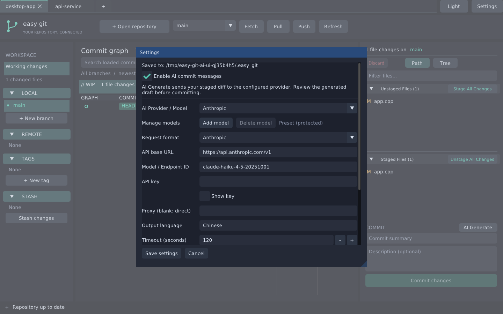
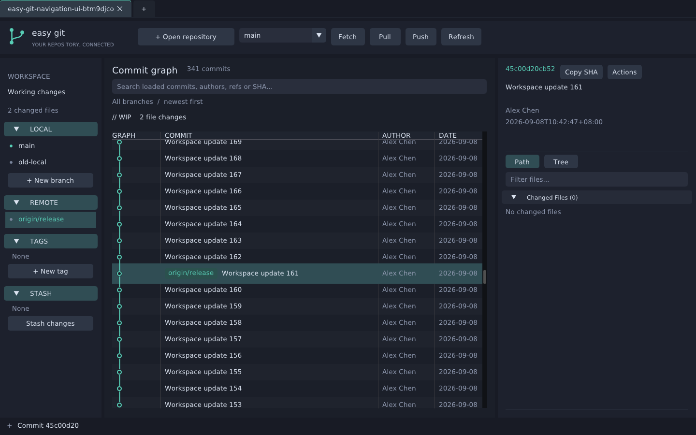
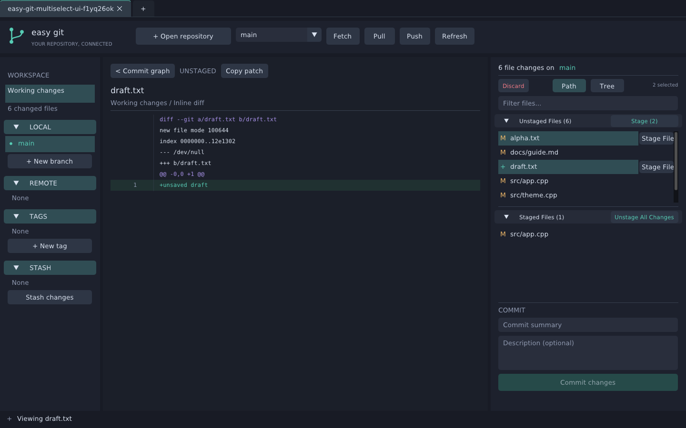
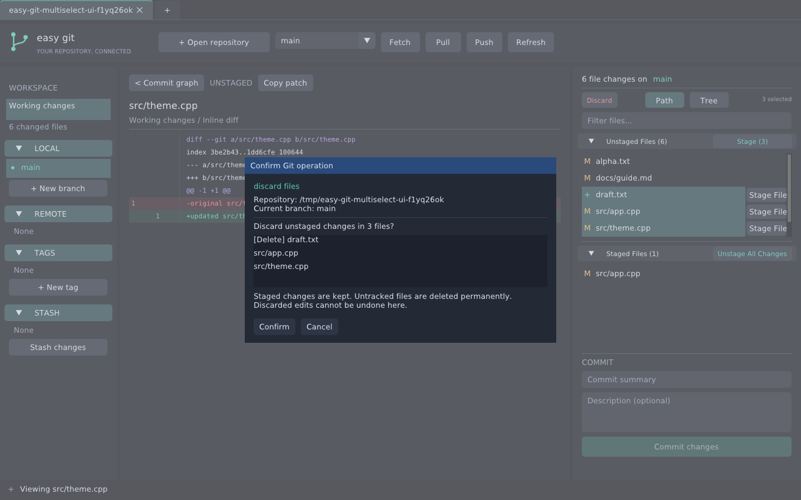
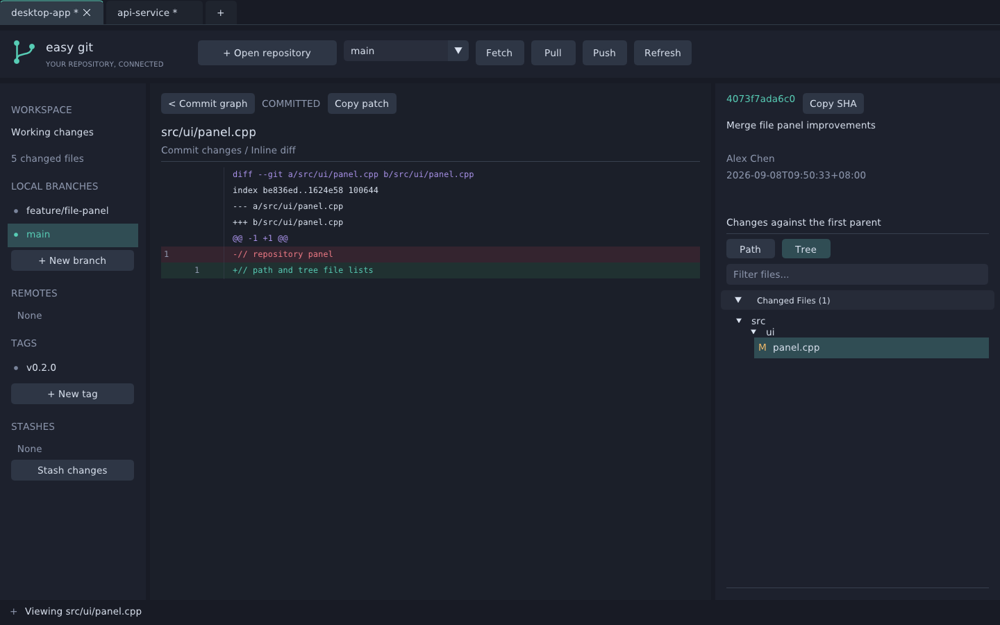

# Easy Git

[English](README.md) | **简体中文**

使用 **C++17 + Dear ImGui + GLFW + OpenGL** 实现的 Linux 桌面 Git 客户端。提供多仓库标签页、提交关系图、浅色/深色主题和可选的 AI 提交信息生成。界面参考 GitKraken；本项目独立开发，与 GitKraken 无隶属或合作关系。

项目处于早期开发阶段，采用 [MIT 许可证](LICENSE)。


## Debian 安装包

从 [GitHub Releases](https://github.com/NickCyrusss/easy_git/releases/tag/v0.1.2) 下载 [v0.1.2 amd64 安装包](https://github.com/NickCyrusss/easy_git/releases/download/v0.1.2/easy-git_0.1.2_amd64.deb) 和 [SHA256SUMS](https://github.com/NickCyrusss/easy_git/releases/download/v0.1.2/SHA256SUMS)。安装包在 Ubuntu 22.04（x86-64）上构建和验证。

```sh
sha256sum -c SHA256SUMS
sudo apt install ./easy-git_0.1.2_amd64.deb
```

包含应用菜单入口和图标。安装后打开 **Easy Git** 或运行 `easy_git`；卸载使用 `sudo apt remove easy-git`，保留用户目录中的 `~/.easy_git` 配置。

自行打包需安装 `dpkg-dev` 及下方构建依赖：

```sh
cmake -S . -B build-deb -G Ninja -DCMAKE_BUILD_TYPE=Release -DCMAKE_INSTALL_PREFIX=/usr
cmake --build build-deb -j 4
ctest --test-dir build-deb --output-on-failure
(cd build-deb && cpack -G DEB)
```

产物位于 `build-deb/`。推送与 CMake 版本一致的标签（如 `v0.1.2`）会运行 Debian 发布工作流，依次构建、测试、验证安装，并上传安装包和校验文件至 GitHub Releases。

## 构建与启动

依赖：Git、CMake 3.22+、C++17 编译器、OpenGL、X11、libcurl 和 json-c 开发库。Ubuntu/Debian 可安装：

```sh
sudo apt install build-essential cmake ninja-build git libgl1-mesa-dev \
  libx11-dev libxrandr-dev libxinerama-dev libxcursor-dev libxi-dev \
  fonts-dejavu-core fonts-noto-cjk zenity pkg-config libcurl4-openssl-dev libjson-c-dev
```

克隆项目并构建：

```sh
git clone https://github.com/NickCyrusss/easy_git.git
cd easy_git
cmake -S . -B build -G Ninja -DCMAKE_BUILD_TYPE=Release
cmake --build build -j 4
./build/easy_git /绝对路径/你的仓库
# 同时打开多个仓库
./build/easy_git /绝对路径/仓库A /绝对路径/仓库B
```

可执行程序已内嵌窗口／任务栏图标。若要在 Linux 应用菜单中显示带图标的 **Easy Git**，可安装到当前用户目录：

```sh
cmake -S . -B build -DCMAKE_INSTALL_PREFIX="$HOME/.local"
cmake --build build -j 4
cmake --install build
```

安装包含程序、桌面启动入口和图标。请从应用菜单启动；文件管理器中的 ELF 可执行文件本身仍可能显示通用图标。

也可直接运行 `./build/easy_git`，点击 **Browse...** 浏览并选择文件夹，再点击 **Open repository**；也支持手动输入路径。取消浏览会保留原路径。文件夹浏览使用系统 Zenity 选择器，未安装时会提示并保留手动输入入口。可打开仓库子目录，操作会自动定位至仓库根目录。

ImGui 固定为 `v1.92.5`，GLFW 固定为 `3.4`，首次配置时由 CMake 下载并校验 SHA-256。离线构建可通过 `FETCHCONTENT_SOURCE_DIR_IMGUI`、`FETCHCONTENT_SOURCE_DIR_GLFW` 指定本地源码；也支持 `.deps/imgui-1.92.5` 和 `.deps/glfw-3.4`。

构建默认不要求代理。若网络需要，可在运行 CMake 前设置 `https_proxy` 和 `http_proxy`，例如 `http://127.0.0.1:32766`；应用内 AI 代理单独配置，默认为空。

## 主题、AI 与配置

- 右上角 **Light / Dark** 一键切换浅色与深色主题，覆盖提交图、文件列表、Diff 和弹窗。
- 右上角 **Settings** 可启用 AI 提交信息，并配置服务商预设、API Base URL、模型/Endpoint ID、API Key、代理、输出语言、超时、输出 token 上限、Diff 字节上限及风格提示词。
- **AI Provider / Model** 提供 36 项可搜索的国内外厂商、推理平台及本地服务预设，包含 DeepSeek、Kimi、通义千问、豆包、OpenAI、Anthropic、Gemini、智谱、MiniMax、百度千帆、腾讯混元等，详见[预设目录与官方接口文档](docs/ai-providers.md)。预设无法删除，模型 ID 和地址仍可按账户、地域修改。
- **Add model** 添加具名自定义模型，同一厂商也可保存多个配置；**Delete model** 确认后删除自定义模型。每项独立保存请求格式、地址、模型、密钥、代理和生成参数；切换时恢复，首次选择预设时使用默认值。**Save settings** 一并保存所有编辑、添加和删除；**Cancel** 全部放弃。旧版固定 Custom 自动迁移成可删除的 **Imported model**，不会丢失原配置。
- **Request format** 可选 **OpenAI**（Chat Completions）或 **Anthropic**（Messages），实际请求和解析按所选格式执行。OpenAI 使用 Bearer 认证，**Token limit field** 可选 `max_tokens` 或 `max_completion_tokens`；Anthropic 使用 `x-api-key`、`anthropic-version` 和顶层 system 字段，仅提取文本块，不把思考块写入提交信息。截断或未完成的响应会报错。
- 默认关闭 AI。启用并保存设置后，先暂存文件，再点击 **COMMIT** 右侧 **AI Generate**。请求只发送暂存区的 Diff 与统计，不发送未暂存改动；返回结果填入摘要和描述，仍需手动检查并提交。生成中可 **Cancel AI**，错误不会清空现有草稿；暂存内容在请求期间变化时会拒绝过期结果。
- AI 默认代理为空，直接连接；可在设置中填写代理地址，本机模型跳过代理。已保存的代理配置保持不变。远程使用 HTTPS，本机可使用 HTTP；API Base URL 接受基础地址或完整 `/chat/completions`、`/messages` 地址。切换格式时需确保地址对应厂商支持的兼容接口，选择格式不会让服务端自动获得协议兼容能力。
- 默认暂存 Diff 上限 65536 字节，超出时提示调整配置或减少暂存文件，不静默截断。调用会产生所选服务商的 API 用量。
- 窗口调整后自动保存宽度和高度，启动时恢复（最小 1080 × 720）。不保存窗口位置、最大化状态及分栏布局。
- 窗口尺寸、已打开仓库、当前仓库、主题和 AI 设置自动覆盖保存到 **`~/.easy_git`**（JSON）。采用临时文件替换，权限为 **0600**；API Key 明文保存在这个仅当前用户可读写的文件中。启动时恢复仓库和设置，关闭的仓库不再恢复；不存在的仓库会显示错误并保留路径，便于下次重试。
- 配置损坏时保留原文件并提示；在 Settings 保存可用当前设置覆盖。可用 `--config /tmp/example.easy_git` 指定测试配置，避免修改正式配置。

旧版未指定请求格式的配置继续使用 OpenAI 格式，兼容之前保存的自定义接口。




## 使用

提交图、提交详情和 Stash 时间按电脑本地时区显示，自动处理夏令时；图中显示日期和时分，详情及悬停提示包含秒与时区。

- 顶部仓库标签页支持切换、拖动排序和关闭；点击 `+` 或 **+ Open repository** 添加仓库。各仓库独立保存文件选择、搜索、面板状态、提交摘要和描述，后台操作不会写入其他仓库。重复打开同一仓库或其子目录时切换到已有标签。
- 左侧选择工作区，或点击中间的 **// WIP**。中间点击 **< Commit graph** 返回提交图时清除文件和 Diff 行选择；后台预览完成后也不会恢复选择。右侧按 GitKraken 的 Commit Panel 形式展示 **Unstaged Files / Staged Files** 两个可折叠区域，支持 **Path / Tree**、文件筛选、状态标记、悬停暂存/取消暂存按钮及右键操作；Path / Tree 切换居中，Discard 位于左侧。区块标题右侧在有选中文件时批量暂存/取消暂存所选文件，无选择时操作全部文件；行内按钮仍只操作该行文件。无需先选中文件，悬停后即可直接点击 **Stage File**／**Unstage**；按住鼠标期间按钮保持显示，松开后执行。
- 文件列表支持 **Ctrl + 点击** 逐个添加/取消选择、**Shift + 点击** 从锚点选择连续范围、**Ctrl + Shift + 点击** 追加范围。Path / Tree、工作区、提交和 Stash 文件列表均支持；跨区块选择会切换到该区块。Tree 的范围按屏幕目录顺序，跳过折叠目录；筛选或折叠后清除不可见文件的选择。
- 右侧未选择任何文件时，**Discard** 可丢弃仓库内全部未暂存改动，包括被筛选或折叠目录隐藏的文件；选中 **Unstaged Files** 中的文件后仅丢弃所选项，也可右键 **Discard selected files...**。仅选中已暂存文件时 Discard 不可用。确认窗口列出完整选择，执行前检查所有文件状态；丢弃未暂存改动并保留已暂存内容，未跟踪文件会永久删除。冲突文件、目录和子模块需在对应编辑器或仓库中处理。
- 输入 **Commit summary** 和可选描述后，点击 **Commit changes**。有未解决冲突或暂存区为空时不能提交。未发送的草稿在标签页名称中用 `*` 标记；关闭此标签前会确认，Git 操作执行期间不关闭标签。
- 中间显示分叉、合并和多父提交关系。点击提交后，右侧显示提交信息及 **Changed Files** 列表，也支持 Path / Tree 和筛选；点击其中一个文件只查看该文件的 Diff，包含重命名和删除文件。
- 工作区和提交文件的 Diff 都在中间展开，显示旧/新行号及增删背景。点击 **< Commit graph** 返回提交图；暂存/取消暂存当前文件后，预览会随其新状态更新。
- 提交历史每次加载 300 条，底部按钮继续加载。搜索只匹配已加载提交；搜索时隐藏关系线，以免省略中间提交后产生错误连线。
- 点击左侧 Local / Remote 分支，自动返回提交图、清除提交搜索并滚动到该分支的最新提交；超出已加载历史时自动补充加载。右侧同步显示该提交的文件。
- 顶部分支下拉框或分支右键菜单切换分支。支持新建分支、标签，以及通过顶部 Fetch 按钮手动更新远端引用、仅快进 Pull、普通 Push。没有 upstream 的本地分支首次 Push 时自动发布到 `origin` 的同名分支并设置跟踪关系；已有 upstream 时沿用原推送配置。
- 左侧顶部搜索框统一按名称过滤 Workspace、Local、Remote、Tags 和 Stash，英文忽略大小写。每个仓库在当前会话中独立保留过滤内容，清空后恢复显示；区域标题和操作按钮始终保留。
- 左侧 **Local / Remote / Tags / Stash** 的折叠标题始终可见，列表在各自区域内独立滚动。上下拖动区域间的分隔线可调整展开区域高度，收起后让出空间；高度比例和折叠状态在各仓库标签内独立保留，仅限当前会话。
- 提交右键菜单或右侧 **Actions** 提供 **Cherry-pick、Merge、Revert、Reset**；分支右键也可合并到当前分支。对合并提交执行 Cherry-pick / Revert 时可选择主线父提交。
- **Reset** 支持 Soft（保留暂存区与工作文件）、Mixed（重置暂存区，保留工作文件）、Hard（覆盖暂存区与工作文件）；执行前确认，Hard 还需勾选丢弃本地改动。Hard 也可能删除阻碍恢复路径的未跟踪文件。
- 顶部 **Pull / Push** 后的 **Stash** 按钮一键保存当前仓库全部已暂存、未暂存和未跟踪改动（不包含被忽略文件），名称取自 **Commit summary**；摘要为空时使用 `Saved from easy git`。成功后清空 **Commit summary**，保留 Description；失败或操作期间输入了新摘要时保留摘要。没有改动、尚无首次提交或操作进行中时不可用。
- Stash 名称不显示 `stash@{n}` 前缀，提交图中使用紫色 **STASH** 标签与分支标识区分，适配浅色和深色主题；**Commit graph** 中的 Stash 条目紧挨各自基准提交之前显示，并连到该提交；同一基准的多个 Stash 按新到旧排列。显示作者及日期，支持搜索、点击预览、右键 Apply／Delete。基准提交尚未加载时，Stash 仍可在左侧访问，加载到基准提交后再显示到图中。
- **Stash changes** 保存已跟踪和未跟踪文件。**单击 Stash 仅预览**：右侧显示 Stash Files，点击文件在中央查看 Diff；**右键 Apply / Delete**，执行前确认。Apply 保留原 Stash，可勾选恢复暂存状态；列表已变化时，Delete 拒绝使用过期的位置删除。
- Merge / Cherry-pick / Revert 遇到冲突后，右侧显示 **Continue / Abort**，适用时提供 **Skip**。在编辑器解决冲突并暂存后点击 Continue；Abort / Skip 前确认。也可继续或中止外部启动的 Rebase。Stash Apply 冲突没有 Git 序列状态，解决并暂存后按普通工作区流程提交。
- 拖动两条面板分隔线调整宽度；按 **F5** 刷新。Git 操作异步执行，失败会显示实际错误。










布局与交互参考：[GitKraken 界面与 Commit Panel](https://help.gitkraken.com/gitkraken-desktop/interface/)、[文件暂存交互](https://help.gitkraken.com/gitkraken-desktop/staging/)。

首次提交需要已有 Git 作者配置；网络认证使用已有 Git credential helper / SSH 配置。程序不保存 Git 凭据，不弹终端密码输入；AI API Key 按上文保存到本地配置。HTTP(S) 远程操作继承启动环境中的代理变量；SSH 代理仍由 SSH 配置决定。

## 按行／区块暂存、丢弃与冲突编辑器

替换修改选中旧行或新行任意一侧时，两侧会联动选择并一起 Stage／Unstage／Discard。连续替换段的新旧行数相同时按位置配对；行数不同时联动整个连续替换段。纯新增／删除仍可逐行操作。高亮选区和 Discard 确认框均显示完整操作范围。

- 工作区 Diff 点击增删行进行选择，支持 Ctrl 切换、Shift 范围选择；点击 **Stage lines** 或右键 **Stage selected lines** 暂存所选行，每个 `@@` 区块有 **Stage hunk**。从 **Staged Files** 打开已暂存 Diff，可点击 **Unstage lines** 或 **Unstage hunk** 按行／区块取消暂存。操作只修改暂存区，预览过期时拒绝执行。二进制、符号链接、子模块及重命名使用整文件操作。
- 从 **Unstaged Files** 打开 Diff，选中增删行后点击 **Discard lines** 或右键 **Discard selected lines...**；也可点击 `@@` 旁的 **Discard hunk**。确认框列出将丢弃的行，仅撤销所选未暂存改动，保留暂存内容和其他改动；预览变化时拒绝执行。支持最大 1 MiB 的普通文本文件；丢弃未跟踪文件的所有行会删除该文件，丢弃后无法在应用中撤销。
- 点击冲突文件打开 **Resolve conflict**：左右对照 **Current／ours** 与 **Incoming／theirs**，下方直接编辑 **Output**。通过 Previous／Next 或非文本输入状态下的上下方向键导航冲突；可勾选两侧的行后 **Apply selected lines**，也可 **Take block／Take both blocks**。**Incoming first** 决定两侧内容合并顺序，**Undo choice** 可撤销最近 16 次选择操作；手工编辑使用文本框自身的撤销功能。支持 **Use entire file**，某侧删除时可 **Accept deletion**；二进制仅支持完整版本选择。仍有冲突标记时禁止保存。**Save and mark resolved** 保存并暂存结果，不自动提交；文件或索引被外部修改时拒绝保存。上限 1 MiB。Rebase 时 Current 是变基后的基准，Incoming 是正在重放的提交。
- 打开仓库窗口增加 **Open / Clone / Initialize**。Clone 目标必须是新目录或空目录；初始化可指定初始分支、保留已有文件且不自动提交。完成后自动打开仓库。
- Local / Remote 分支右键增加 **Delete branch...**，删除本地未合并分支需明确勾选，Git 会保护正在工作树检出的分支。远端删除校验已知分支 tip，避免删除已变化的分支。
- **Push** 或当前本地分支右键增加 **Force push with lease...**，确认源分支及远端目标后执行；需要已配置 upstream 并获取远端跟踪分支。使用明确的 `--force-with-lease` 预期提交，远端 tip 变化时拒绝覆盖。

交互参考：[GitKraken 按行暂存](https://support.gitkraken.com/working-with-commits/staging/)、[冲突处理](https://help.gitkraken.com/gitkraken-desktop/branching-and-merging/)。


## 验证

```sh
ctest --test-dir build --output-on-failure
```

测试只在 `/tmp` 创建临时仓库。`git_workflow` 验证空仓库、中文/空格/换行路径、字面量参数、部分暂存、提交、重命名、合并图、多父提交布局、分页、Detached HEAD、Stash、本地远程推拉，以及根提交/合并提交/删除/二进制文件的文件列表和单文件 Diff。

`git_operations` 验证 Cherry-pick / Merge / Revert、合并提交主线选择、三种 Reset、Stash 只读预览与未跟踪文件、恢复暂存状态、过期删除保护，以及真实冲突的继续、中止和跳过、外部 Rebase 中止、独立 Worktree 的操作状态，以及 Discard 对部分暂存、删除、重命名、特殊路径、符号链接和过期状态的处理，以及批量 Discard 的整组选中文件检查和暂存内容保留。

`git_workflows` 验证按行／区块暂存、取消暂存及丢弃、替换行联动与连续修改的行顺序、新旧行数不等的替换段整体处理、选区隔离与过期预览拒绝、特殊路径与文件末尾处理、冲突结果保存与残留 diff3 标记拒绝、Clone／初始化、删除本地／远端分支、首次 Push 创建远端分支并设置 upstream、已有 upstream 的沿用、非快进／Detached HEAD／缺少 origin 的拒绝，以及强制推送 lease 保护。

`settings_and_ai` 使用本地回环 HTTP 模拟服务验证 OpenAI / Anthropic 两种 JSON 请求、对应认证头和响应解析、仅暂存区内容、中文响应、HTTP/格式错误、取消请求、暂存区变化保护，以及配置覆盖保存、各服务商配置切换与重启恢复、旧配置迁移、自定义模型增删与预设删除保护、窗口尺寸读写与非法值校验、0600 权限与损坏配置处理；不调用付费模型。运行此测试需要允许本机监听端口。

`repository_tabs` 使用真实 ImGui 状态（无需 X 服务）验证侧栏标题固定、长列表独立滚动、区域分隔线拖动及折叠展开、侧栏各区域统一过滤与英文大小写／中文匹配、清空恢复和仓库间隔离、标签点击、独立草稿与文件选择、切换期间的后台 Diff/暂存、相同根目录去重、关闭保护、文件树及 Diff 行号，以及 Stash / Discard 的仓库隔离、分支跨分页定位和提交图滚动、Ctrl / Shift / Ctrl+Shift 多选、连续点击的 Diff 更新、Tree 可见范围、筛选及批量暂存/取消暂存/丢弃、未选中文件时行内按钮的按下／保持／释放、无选区 Stage All／Unstage All、1080×720 下顶部 Stash 点击及摘要命名、暂存／未暂存／未跟踪内容保存、成功清空摘要与失败保留、Stash 按基准提交分组与分页加载、提交图 Stash 搜索及点击预览、主题/模型配置与仓库重启恢复、自定义模型增删的保存与取消、区块取消暂存、替换行 Ctrl／Shift 联动选择及完整丢弃范围的确认／取消、外部编辑／原子保存／删除恢复后的 Diff 自动刷新、关闭预览及已暂存预览隔离、AI 失败保留草稿、本地时间的跨时区与夏令时转换、冲突逐行选择／组合顺序／撤销和输出大小保护。

无需图形依赖也可单独测试 Git 后端：

```sh
cmake -S . -B build-core -DEASY_GIT_BUILD_GUI=OFF
cmake --build build-core
ctest --test-dir build-core --output-on-failure
```

可选图形烟雾检查（需要 `xvfb`、`xauth`）：

```sh
xvfb-run -a -s '-screen 0 1440x900x24' \
  ./build/easy_git /你的仓库 --config /tmp/easy-git-smoke.json \
  --frames 30 --screenshot /tmp/easy-git.ppm
```

`docs/` 的截图来自真实临时测试仓库。按区块操作已用真实鼠标验证：暂存一个区块、确认丢弃另一区块并保留暂存内容，再取消暂存第一个区块并保留工作区改动。新版界面已用实际鼠标、键盘检查多仓库切换、草稿保留、单文件暂存、提交文件列表与 Diff、Path / Tree 切换及 1080×720 布局。Git 操作界面另验证了 Local / Remote / Stash 折叠、Stash 预览与 Apply / Delete、Cherry-pick 和 Hard Reset 的勾选保护及执行。新增分支定位检查使用 341 个提交验证跨页跳转及 Remote 定位；Discard 检查验证取消、确认及保留暂存内容；另用真实 Ctrl / Shift 按键和鼠标验证多选、Tree 折叠范围、批量暂存/丢弃及窄窗口工具栏。主题/AI 界面已验证中文生成结果填入、浅色与深色切换、设置编辑保存和重启后当前仓库恢复。窗口尺寸另经 Xvfb 实测：调整为 1220 × 780 后自动保存宽高，重启恢复相同尺寸；不保存窗口位置或分栏布局。

验证内嵌图标与桌面窗口标识（需要 Python 3、`xvfb`、`xauth` 和 `x11-utils` 提供的 `xprop`）。测试将程序复制到临时目录，并使用临时配置运行：

```sh
xvfb-run -a python3 tests/icon_smoke.py build/easy_git
```

## 当前边界

- 当前仅支持 Linux / X11（Wayland 桌面可通过 XWayland 运行），最低窗口尺寸为 1080×720；未实现 Windows/macOS 进程后端。
- 合并提交展示相对第一父提交的 Diff；工作区支持整文件及按行／区块暂存、取消暂存和丢弃；尚无交互式 Rebase 编辑器或拖拽提交。二进制冲突仅支持选用完整版本，符号链接和子模块冲突需在外部处理。
- 窗口尺寸、仓库、当前仓库、主题和 AI 设置持久化；提交草稿、文件选择和面板布局仅保留在当前会话，退出后不恢复；当前打开的未暂存 Diff 每 0.5 秒检测外部保存或删除，后台刷新并在内容变化时清除旧行选区；Commit／Stash／已暂存预览不受工作区修改影响，其他外部仓库变化仍需手动刷新。Clone、初始化、删除分支及带 lease 的强制推送已提供界面入口。
- 单次 Git 命令超时 120 秒，输出预览上限 8 MiB。超限时明确报错，不显示不完整的仓库结构。
- 远程操作已使用本地远程仓库验证；AI 请求使用本地模拟接口验证，尚未使用用户的 API Key 调用真实服务商。

实现参考：[Dear ImGui 官方 GLFW/OpenGL 示例](https://github.com/ocornut/imgui/tree/v1.92.5/examples/example_glfw_opengl3)、[Git status 格式](https://git-scm.com/docs/git-status)、[Git log 格式](https://git-scm.com/docs/pretty-formats)。

## 参与贡献

欢迎提交 [Issue](https://github.com/NickCyrusss/easy_git/issues) 或 Pull Request。报告问题时请提供 Linux 发行版、复现步骤和相关错误信息；不要附带 API Key、个人配置文件或私有仓库内容。修改 Git 操作、配置或 AI 请求后，请运行相关测试，并说明界面改动的验证方式。

## 许可证与致谢

项目代码采用 [MIT 许可证](LICENSE)。感谢 [Dear ImGui](https://github.com/ocornut/imgui)、[GLFW](https://github.com/glfw/glfw)、[libcurl](https://curl.se/libcurl/)、[json-c](https://github.com/json-c/json-c) 和 [Git](https://git-scm.com/)。第三方项目遵循各自的许可证。
